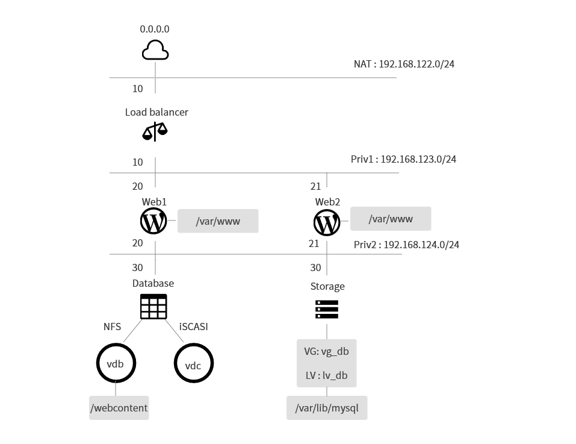

<Haproxy를 활용한 웹서버 로드밸런싱>
==================================================

# 1. 실습 목적
+ 설치형 블로그 앱 Wordpress를 활용하여 WEB-DB 구축한다.
+ 소프트웨어 로드 밸런서 Haproxy를 통해 웹서버 로드 밸런싱을 구현한다.

# 2. 구성도

+ Load balancer
  + 웹서버 로드밸런싱을 담당하는 서버
  + 사용 소프트웨어
    + Haproxy
  
+ Web1 / Web2
  + Wordpress를 통해 웹서비스를 담당하는 서버
  + 사용 소프트웨어
    +Apache / PHP / Wordpress
  
+ Database
  + Wordpress에 필요한 DB가 작동하는 서버
  + 사용 소프트웨어
    + MaraiDB

+ Storage
  + 웹서버 및 DB서버에 필요한 디렉토리 및 디바이스를 제공하는 서버
  + NFS
    + 대상 디렉토리 - Storage : /webcontent
    + 마운팅 포인트 - Web1 : /var/www
                     Web2 : /var/www
    
  + iSCSI
    + 대상 디바이스 - /dev/vdc
    + 마운팅 포인트 - /var/lib/mysql
    

# 3. 실습 과정
4.1 각 서버의 네트워크 구성
4.2 스토리지 서버 구성
4.3 서비스 디렉토리 마운팅(Web Server/ DB Server)
4.4 DB 서버 구성
4.5 WEB 서버 구성
4.6 LB 서버 구성
4.7 LB 테스트
