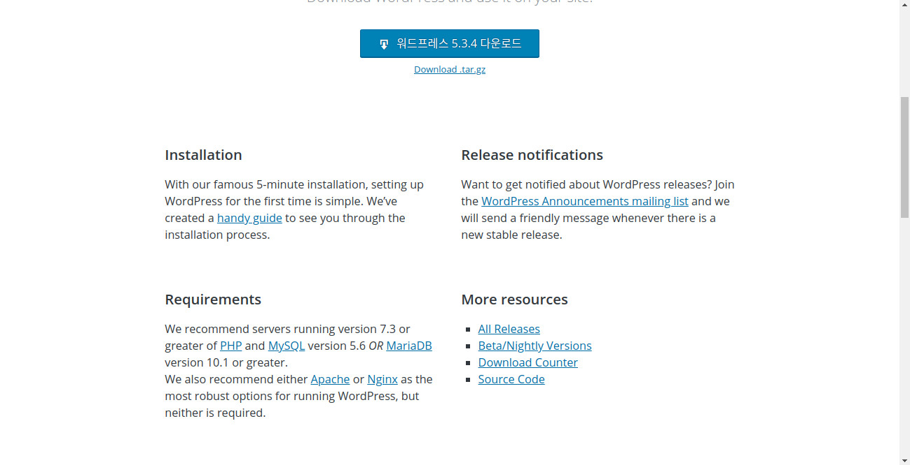
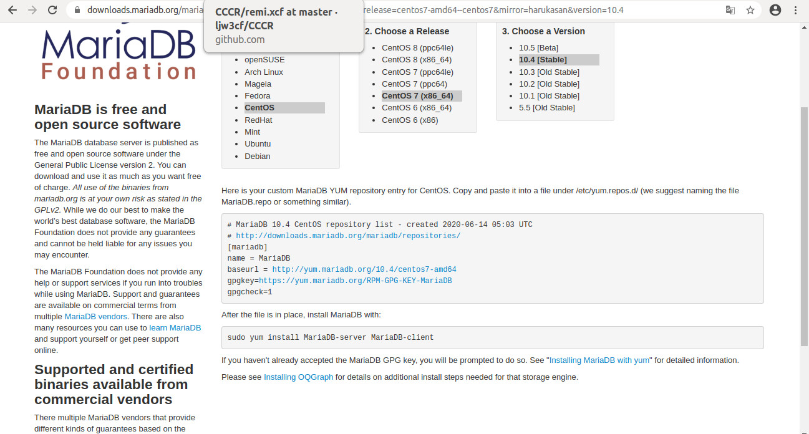

<Haproxy를 활용한 웹서버 로드밸런싱>
==================================================

# 1. 실습 목적
+ 설치형 블로그 앱 Wordpress를 활용하여 WEB-DB 구축한다.
+ 소프트웨어 로드 밸런서 Haproxy를 통해 웹서버 로드 밸런싱을 구현한다.

# 2. 구성도

+ 네트워크 구성
  + NAT (192.168.122.0/24) 
    + LB서버와 외부 네트워크 통신을 위해 구축
    + 서버 ip : LB (192.168.122.10)
  + Priv1 (192.168.123.0/24)
    + 로드 밸런싱을 위한 LB와 WEB의 통신 네트워크
    + 서버 ip : Web1 (192.168.123.20)
                Web2(192.168.123.21)
                LB (192.168.123.10)
   + Priv2 (192.168.124.0/24)
      + Web-DB 통신과 Storage서버의 디렉토리/블록 스토리지 제공을 위한 네트워크
      + 서버 ip :Web1 (192.168.124.20)
                Web2 (192.168.124.21)
                Storage (192.168.124.30)
                DB (192.168.124.40)
+ Load balancer
  + 웹서버 로드밸런싱을 담당하는 서버
  + 사용 소프트웨어
    + Haproxy
  
+ Web1 / Web2
  + Wordpress를 통해 웹서비스를 담당하는 서버
  + 사용 소프트웨어
    + Apache / PHP / Wordpress
  
+ Database
  + Wordpress에 필요한 DB가 작동하는 서버
  + 사용 소프트웨어
    + MaraiDB

+ Storage
  + 웹서버 및 DB서버에 필요한 디렉토리 및 디바이스를 제공하는 서버
  + NFS
    + 대상 디렉토리 - Storage : /webcontent
    + 마운팅 포인트 - Web1 : /var/www
                     Web2 : /var/www
    
  + iSCSI
    + target 디바이스 (iqn.2020-06.com.example:storage) - /dev/vdc 
    + initiator 마운팅 포인트 (iqn-2020-06.com.example:database) - /var/lib/mysql 
    

# 3. 실습 과정
4.1 각 서버의 네트워크 구성
  + Network Manager (nmcli / nmtui)를 통한 각 서버의 Network 구성
  + Network 구성 후 ping 테스트 진행 (각 네트워크에 해당하는 interface 구분할 것!!!)
    + e.g) Load balancer의 외부네트워크 및 Web1에 대한 ping 테스트
      <pre>
      <code>
      [student@LB ~]$ sudo ping 8.8.8.8 -I eth0
      [student@LB ~]$ sudo ping 192.168.123.20 -I eth1
      </code>
      </pre>
       
4.2 스토리지 서버 구성
  + yum을 통해 nfs-utils / targetcli 설치
      <pre>
      <code>
      [student@Storage ~]$ sudo yum install -y nfs-utils targetcli 
      </code>
      </pre>
       
    + target 서비스 시작
    <pre>
    <code>
    [student@Storage ~]$ systemctl start target
    [student@Storage ~]$ systemctl enable target
    </code>
    </pre>
    
  + nfs 설정
    + 마운팅 대상 디렉토리 생성
      <pre>
      <code>
      [student@Storage ~]$ mkdir /webcontent 
      </code>
      </pre>

    + /dev/vdb를 /webcontent와 마운트하고, fstab에 규칙을 적용한다.

    + /etc/exports에 nfs 옵션 설정
    
      /etc/exports 파일에 디렉토리의 경로, ACL, 옵션을 작성하고, exportfs -r 커맨드로 테이블 경로를 재지정한다.   
      
      (**권한에 대한 nfs 옵션 디폴트 옵션은 root_squash이며, 클라이언트 root가 nfsnobody와 같은 사용자로 맵핑된다는 의미이다.  
         이는 nfs 클라이언트에 해당하는 web서버에서 권한 불일치로 인한 Apache 네트워크 오류를 초래할 수 있다.  
         이를 방지하기 위해 no_root_squash 옵션을 사용하여, 서버와 클라이언트 root사용자를 일치 시키도록 하자**)
         
      <pre>
      <code>
      /webcontent   192.168.123.0/24(rw,sync,no_root_squash) 
    
      [student@Storage ~]$ sudo exportfs -r
    
      </code>
      </pre>
  
    + nfs-server 서비스 시작
      <pre>
      <code>
      [student@Storage ~]$ sudo systemctl start nfs-server
      [student@Storage ~]$ sudo systemctl enable nfs-server
      </code>
      </pre>

    + nfs 관련 방화벽 설정
      <pre>
      <code>
      [student@Storage ~]$ firewall-cmd --add-service=nfs --permanent
      [student@Storage ~]$ firewall-cmd --add-service=rpc-bind --permanent
      [student@Storage ~]$ firewall-cmd --add-serivce=mountd --permanent
      </code>
      </pre>
      
  + iSCSI 설정
    + block 타입의 backstore 생성
      <pre>
      <code>
      [student@Storage ~]$ targetcli
      Warning: Could not load preferences file root/.targetcli/prefs.bin.
      targetcli shell version 2.1.fb41
      Copyright 2011-2013 by Datera, Inc and others.
      For help on commands, type 'help'
      
      /> /backstores/block create name=vdc dev=/dev/vdc
      Created block storage object vdc using /dev/vdc
       
      </code>
      </pre>
    
    + iQN 주소 설정
      <pre>
      <code>
      /> create wwn=iqn.2020-06.com.example:storage
      Created target iqn.2020-06.com.example:storage.
      Created TPG 1.
      Global pref auto_add_default_portal=true
      Created default portal listening on all IPs (0.0.0.0), port 3260.
      </code>
      </pre>
    
    + ACL 설정
    <pre>
    <code>
    /> /iscsi/iqn.2020-06.com.example:storage/tpg1/acls create wwn=iqn.2020-06.com.example:database
    Created Node ACL for iqn.2020-06.com.example:database
   </code>
   </pre>
   
   + LUN 설정
    <pre>
    <code>
    /> /iscsi/iqn.2020-06.com.example:storage/tpg1/luns create storage_object=/backstores/block/vdc lun=lun=0
    Created LUN 0.
    Created LUN 0->0 mapping in node ACL iqn.2020-06.com.example:database
   </code>
   </pre>
   
   + target 서비스 재시작 및 방화벽 설정
     변경사항 적용을 위해 target 서비스를 재시작하고, 타겟 포트 3260을 허용한다.
    <pre>
    <code>      
    [student@Storage ~]$systemctl restart target
    [student@Storage ~]$firewall-cmd --add-port=3260 --permanent
    [student@Storage ~]$firewall-cmd --reload
   </code>
   </pre>
   
4.3 서비스 디렉토리 마운팅(Web Server/ DB Server)
  + Web Server 마운트
    + 마운트 대상 디렉토리 (/var/www)를 생성한다.
    
    + mount 명령을 사용하여 storage서버 nfs설정 디렉토리에 대한 원격 마운트를 진행한다.
    <pre>
    <code>      
    [student@SWeb1 ~]$sudo mount -o rw,sync 192.168.124.40:/webcontent /var/www
   </code>
   </pre>
    
    + fstab에 마운트 규칙을 입력한다.
    
    <pre>
    <code>      
    [student@Web1 ~]$vim /etc/fstab
    ...
    192.168.124.40:/webcontent /var/www nfs rw,sync 0 1
    
   </code>
   </pre>    
    
    + Web2에서도 같은 방식으로 원격 마운트를 실시한다.
    
  + DB Server 마운트
    + 마운트 대상 디렉토리(/var/lib/mysql)를 생성한다.
    
    + storage 서버의 block store와 연결하기 위해 iscsi-initiator-utils 설치한다.
    
    + iqn 설정을 위해 /etc/iscsi/intiatorname.iscsi에 DB Server의 iqn을 입력한다.
    <pre>
    <code>      
    [student@DB ~]$vim /etc/iscsi/intiatorname.iscsi
    ...
    InitiatorName=iqn.2020-06.com.example:database
    </code>
    </pre>    
   
    + iscsi 서비스를 활성화 한다.

    + iscsi 연결을 위해 target을 검색한 뒤, 타겟에 연결한다.
    
    <pre>
    <code>      
    [student@DB ~]$iscsiadm -m discovery -t st -p 192.168.124.40
    192.168.124.40,1 iqn.2020-06.com.example:storage
    [student@DB ~]$iscsiadm -m node -T iqn.2020-06.com.example:storage -l
    </code>
    </pre>
    
    + iscsi로 연결된 디바이스의 파티셔닝 / pvcreate / vgcreate / lvcreate 진행한다.   
     lv생성 후, /var/lib/mysql과 마운팅하고 fstab에 마운트 규칙도 추가해준다.
    
    <pre>
    <code>  
    ***iscsi로 외부에서 연결된 마운트포인트는 fstab의 옵션에 _netdev를 꼭! 꼭!!! 꼭!!!!!!! 추가해주자***   
    _netdev는 해당 마운트는 네트워크 이후에 진행하라는 옵션이다.   
    리눅스 부팅시 마운트 이후 네트워크 연결을 진행한다.   
    상기 마운트포인트는 네트워크를 통해 연결된 마운트포인트이기 때문에, _netdev 옵션 없이 재부팅 시   
    마운트포인트 경로를 찾을 수 없어 emergency mode로 전환된다.
    </code>
    </pre>
    
4.4 DB 서버 구성
  + Wordpress의 DB로 사용할 MariaDB를 설치한다.  
    MariaDB는 yum으로 설치 가능하며, CentOS 7버전 기준 repository에 MariaDB 5버전이 등록되어 있다.  
    
    하지만 Wordpress는 설치를 위해 요구하는 MariaDB는 10버전 이상이다.(Wordpress 10.4.3 기준)  
    
    > Wordpress 공식홈페이지에서 확인한 요구사양.  
      PHP 7.3 이상 / MariaDB 10.1 이상을 필요로 한다.
    별도로 MariaDB 10 이상 버전을 설치할 필요가 있다.
    
 + MariaDB 공식사이트로 접속하여 MariaDB 10.4 설치방법을 확인한다.
   
   > MariaDB 공식사이트에서 안내하는 MariaDB 10.4 설치방법.  
     yum에 MariaDB repository를 추가하는 방식으로 진행된다.
   
  + 공식사이트의 안내에 따라 MariaDB 10.4 repository를 추가한다.
    <pre>
    <code>
    [student@db ~]$ vim /etc/yum.repos.d/mariadb.repo  
    ...  
    [mariadb]  
    name = MariaDB  
    baseurl = http://yum.mariadb.org/10.4/centos7-amd64  
    gpgkey=https://yum.mariadb.org/RPM-GPG-KEY-MariaDB  
    gpgcheck=1  
      
    [student@db ~]$ yum repolist   
    MariaDB                                         149 kB/s | 503 kB     00:03  
    repo id                        repo name                                  status  
    AppStream                      CentOS-8 - AppStream                       5,318  
    BaseOS                         CentOS-8 - Base                            1,661  
    extras                         CentOS-8 - Extras                             20  
    mariadb                        MariaDB                                       80  
    </code>
    </pre>
    
    + yum을 통해 MariaDB 10.4를 설치한다.
    <pre>
    <code>
    [student@db ~]$ sudo yum install MariaDB-server
    </code>
    </pre>
    
    + MariaDB 서비스 활성화하고, Web과 통신하기 위해 3306포트를 활성화한다.  
    <pre>
    <code>
    [student@db ~]$ sudo systemctl start mariadb  
    [student@db ~]$ sudo systemctl enable mariadb  
    [student@db ~]$ sudo firewall-cmd --add-port=3306/tcp --permanent  
    [student@db ~]$ sudo firewall-cmd --reload
    </code>
    </pre>
    
    + MariaDB에 Wordpress에 필요한 database와 사용자(Web1 및 Web2)를 추가한다.
    <pre>
    <code>
    [student@db ~]$ sudo systemctl start mariadb  
    [student@db ~]$ mysql -u root -p  
    Enter password:   
    Welcome to the MariaDB monitor.  Commands end with ; or \g.  
    Your MariaDB connection id is 8  
    Server version: 10.3.17-MariaDB MariaDB Server  
      
    Copyright (c) 2000, 2018, Oracle, MariaDB Corporation Ab and others.  
      
    Type 'help;' or '\h' for help. Type '\c' to clear the current input statement.  
      
    MariaDB [(none)]> CREATE DATABASE wordpress_db;
    Query OK, 1 row affected (0.002 sec)

    MariaDB [(none)]> CREATE USER 'wp-admin'@'192.168.124.20' \  
        -> IDENTIFIED BY 'dkagh1';  
    Query OK, 0 rows affected (0.001 sec)  
  
    MariaDB [(none)]> CREATE USER 'wp-admin'@'192.168.124.21' \  
        -> IDENTIFIED BY 'dkagh1';  
    Query OK, 0 rows affected (0.001 sec)  
    </code>  
    </pre>  
    
   + Web1 및 Web2 사용자에게 Wordpress_db에 대한 모든 권한을 허용한다.
   <pre>
   <code>
   MariaDB [(none)]> use wordpress_db  
   Database changed  
  
   MariaDB [(wordpress_db)]> GRANT ALL PRIVILEGES ON wordpress_db TO \  
    -> 'wp-admin'@'192.168.124.20' IDENTIFIED BY 'dkagh1.';  
   Query OK, 0 rows affected (0.001 sec)  

   MariaDB [(wordpress_db)]> GRANT ALL PRIVILEGES ON wordpress_db TO \  
    -> 'wp-admin'@'192.168.124.21' IDENTIFIED BY 'dkagh1.';  
   Query OK, 0 rows affected (0.001 sec)  

   MariaDB [wordpress_db]> FLUSH PRIVILEGES  
   Query OK, 0 rows affected (0.001 sec)  
   
   </code>
   </pre>

4.5 WEB 서버 구성
  + yum을 통해 apache2 패키지(httpd)를 설치한다.
  <pre>
  <code>
  [student@web1 ~]$ sudo install -y httpd
  </code>
  </pre>
  
  + httpd 서비스 및 http 포트(80)를 활성화한다.
  <pre>
  <code>
  [student@web1 ~]$ sudo systemctl start httpd  
  [student@web1 ~]$ sudo systemctl enable httpd  
  [student@web1 ~]$ sudo firewall-cmd --add-service=http --permanent  
  [student@web1 ~]$ sudo firewall-cmd --reload  
  </code>
  </pre>

  + apache2가 xfs로 마운트된 디렉토리 및 외부네트워크의 db를 사용하기 위해, 관련 seboolean 규칙을 활성화한다.
  <pre>
  <code>
  [student@web1 ~]$ getsebool -a | grep httpd  
  ...  
  httpd_can_network_connect_db --> off  
  ...  
  httpd_use_nfs --> off  
  ...  
  [student@web1 ~]$ sudo setsebool -P httpd_can_network_connect_db on
  [student@web1 ~]$ sudo setsebool -P httpd_use_nfs on
  </code>
  </pre>
  
  + Wordpress 설치에 필요한 PHP 7 이상 버전을 설치한다.  하지만 Centos 7 기준 yum repository에 PHP 7 이상 버전은 없다.  
    따라서 remi라고 불리는 별도의 repository를 설치하여 PHP를 설치할 필요가 있다.  
    
  + 먼저 yum을 통해 remi의 의존성 패키지인 epel-release 패키지를 설치한다.
  <pre>
  <code>
  [student@web1 ~]$ sudo yum install -y epel-release
  </code>
  </pre>
  
  + remi 공식사이트에서 centos7버전의 rpm 패키지를 다운받고, rpm을 통해 설치한다.
  
  > remi 공식사이트에서 centos7버전 remi 패키지 경로를 확인한다.
   
  + wget으로 remi rpm 패키지를 다운 받고, rpm으로 해당 패키지를 설치한다.
   <pre>
   <code>
   [student@web1 ~]$ wget https://rpms.remirepo.net/enterprise/remi-release-7.rpm  
   --2020-06-14 15:03:15--  https://rpms.remirepo.net/enterprise/remi-release-7.rpm  
   Resolving rpms.remirepo.net (rpms.remirepo.net)... 195.154.241.117, 2001:bc8:33a1:100::1  
   Connecting to rpms.remirepo.net (rpms.remirepo.net)|195.154.241.117|:443... connected.  
   HTTP request sent, awaiting response... 200 OK  
   Length: 20440 (20K) [application/x-rpm]  
   Saving to: ‘remi-release-7.rpm’  

   remi-release-7.rpm  100%[===================>]  19.96K  62.9KB/s    in 0.3s    

   2020-06-14 15:03:24 (62.9 KB/s) - ‘remi-release-7.rpm’ saved [20440/20440]
   
   [student@web1 ~]$ rpm -i remi-release-7.rpm
   warning: remi-release-7.rpm: Header V4 RSA/SHA256 Signature, key ID 5f11735a: NOKEY
   </pre>
   <code>
 
  + yum repolist로 확인 시, remi repository는 remi-safe가 디폴트로 되어있다.  
    /etc/yum.repos.d/ 에서 remi-safe.repo를 비활성화시키고, remi-php74.repos를 활성화시킨다.  
    이후 yum으로 php 패키지와 php-mysql 모듈을 설치한다.
    
  + wordpress 공식사이트에서 wordpress 최신 패키지를 /var/www/html에 다운받는다.
    이후 tar 커맨드로 압축을 풀어준다.
    
  + 웹브라우저에서 web1로 접속하여, db명, 사용자명, 패스워드, db서버 위치를 입력하고 wordpress를 설치한다.
  
  + web2도 같은 방식으로 httpd / php / wordpress를 설치한다.
  
   4.6 LB 서버 구성
  + yum을 통해 haproxy 패키지를 설치한다.
  <pre>
  <code> 
  [student@lb ~]$ sudo yum install -y haproxy
  </code>
  </pre>
  
  + /etc/haproxy/haproxy.cfg 파일을 수정하여, 80번 포트를 listen시켜준다. 그리고 web1, web2를 roundrobin 방식으로 loadbalacing 해준다.
  <pre>
  <code>
  [student@lb ~]$ vim /etc/haproxy/haproxy.cfg 
  ...
  #---------------------------------------------------------------------  
  # main frontend which proxys to the backends  
  #---------------------------------------------------------------------  
  frontend main   
    bind *:80 (디폴트로 5000번으로 listen되어 있는데, 이를 80번으로 바꿔준다.)  
    acl url_static       path_beg       -i /static /images /javascript /stylesheets  
    acl url_static       path_end       -i .jpg .gif .png .css .js  
    
    use_backend static          if url_static
    default_backend             app

  #---------------------------------------------------------------------
  # static backend for serving up images, stylesheets and such
  #---------------------------------------------------------------------
  backend static
      balance     roundrobin
      server      static 127.0.0.1:4331 check
  
  #---------------------------------------------------------------------
  # round robin balancing between the various backends
  #---------------------------------------------------------------------
  backend app
      balance     roundrobin
      server  wwwl 192.168.123.20 (web1의 priv1 네트워크 ip)
      server  www2 192.168.123.21 (web2의 priv2 네트워크 ip)
  </code>
  </pre>
  
  + haproxy 서비스 활성화 시켜준다.
  <pre>
  <code>
  [student@lb ~]$ sudo systemctl start haproxy
  [student@lb ~]$ sudo systemctl enable haproxy
  </code>
  </pre>

  + 외부네트워크와 통신하기 위해 http 포트 활성화 시켜준다.  
  <pre>
  <code>
  [student@lb ~]$ sudo firewall-cmd --add-service=http --permanent
  [student@lb ~]$ sudo firewall-cmd --reload
  </code>
  </pre>

  + lb ip로 wordpress 접속하여, 접속여부를 확인한다.  
  
  + web1, web2의 /var/log/httpd/access_log 확인하여, 제대로 loadbalancing 되고 있는지 확인한다.  
  <pre>
  <code>
  [student@web1 ~]$ tail -f /var/log/httpd/access_log  
  
  [student@web2 ~]$ tail -f /var/log/httpd/access_log  
  </code>
  </pre>
